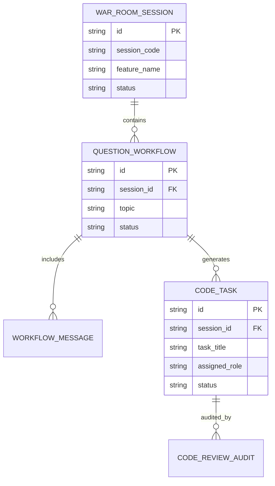

# 🗄️ Entity-Relationship Diagram: WF-1: Codebase Reality & AST Extraction

```mermaid
erDiagram
    WAR_ROOM_SESSION ||--o{ QUESTION_WORKFLOW : contains
    QUESTION_WORKFLOW ||--o{ WORKFLOW_MESSAGE : includes
    QUESTION_WORKFLOW ||--o{ CODE_TASK : generates
    CODE_TASK ||--o{ CODE_REVIEW_AUDIT : audited_by

    WAR_ROOM_SESSION {
        string id PK
        string session_code
        string feature_name
        string status
    }
    QUESTION_WORKFLOW {
        string id PK
        string session_id FK
        string topic
        string status
    }
    CODE_TASK {
        string id PK
        string session_id FK
        string task_title
        string assigned_role
        string status
    }
```
