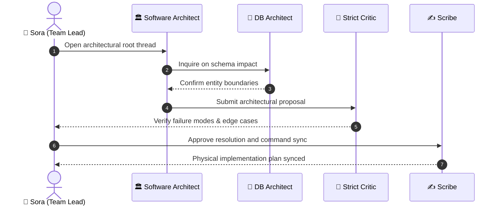

# 🔄 Sequence Diagram: WF-1: Codebase Reality & AST Extraction

```mermaid
sequenceDiagram
    autonumber
    actor Sora as 👑 Sora (Team Lead)
    participant Architect as 🏛️ Software Architect
    participant DB as 🧠 DB Architect
    participant Critic as 🧐 Strict Critic
    participant Scribe as ✍️ Scribe

    Sora->>Architect: Open architectural root thread
    Architect->>DB: Inquire on schema impact
    DB-->>Architect: Confirm entity boundaries
    Architect->>Critic: Submit architectural proposal
    Critic-->>Sora: Verify failure modes & edge cases
    Sora->>Scribe: Approve resolution and command sync
    Scribe-->>Sora: Physical implementation plan synced
```
