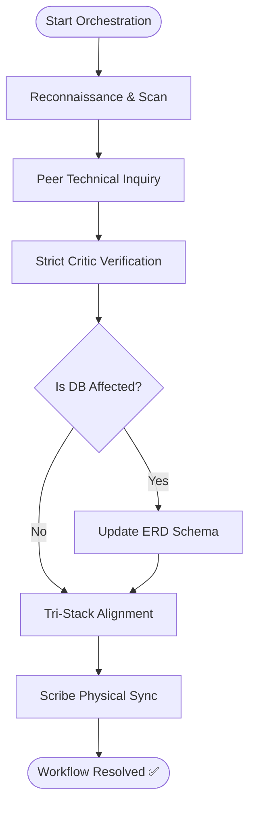

# 📊 Activity Diagram: WF-2: User-Defined Custom AI Models Domain Decomposition

```mermaid
flowchart TD
    Start([Start Orchestration]) --> Recon[Reconnaissance & Scan]
    Recon --> PeerInquiry[Peer Technical Inquiry]
    PeerInquiry --> CriticReview[Strict Critic Verification]
    CriticReview --> DBGate{Is DB Affected?}
    DBGate -->|Yes| UpdateSchema[Update ERD Schema]
    DBGate -->|No| TriStack[Tri-Stack Alignment]
    UpdateSchema --> TriStack
    TriStack --> ScribeSync[Scribe Physical Sync]
    ScribeSync --> Finish([Workflow Resolved ✅])
```
